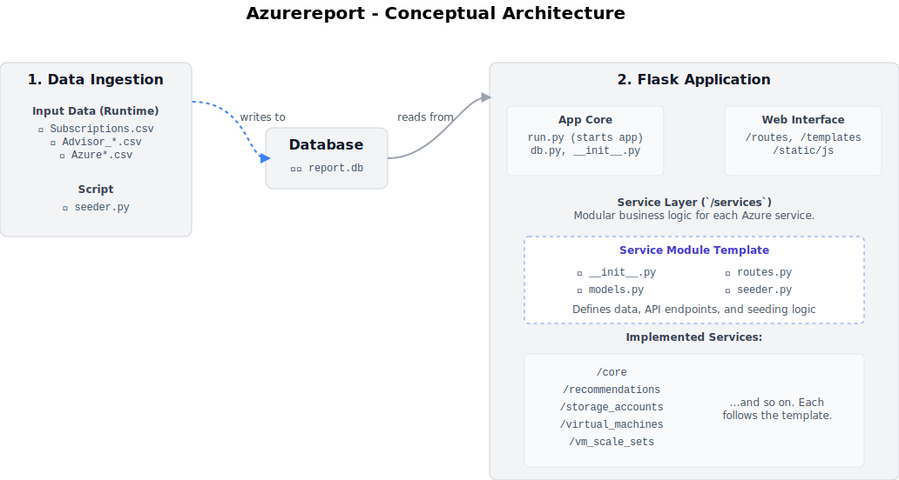

# **Azure Reporting and Visualization Application**

This application is designed to process, analyze, and visualize data exported from a Microsoft Azure environment. It parses various CSV reports generated by Azure, normalizes the data into a relational database, and presents it through an interactive web interface. The goal is to provide a clear, consolidated view of Azure resources and recommendations, helping to identify potential cost savings, security improvements, and operational enhancements.

## **Key Features**

* **Interactive Dashboard:** A central dashboard provides a high-level overview of the environment with key performance indicators (KPIs) and summary charts.  
* **Detailed Resource Lists:** Browse, sort, and filter through lists of discovered Azure resources like Virtual Machines, VM Scale Sets, and Storage Accounts.  
* **Consolidated Recommendations:** View all Azure Advisor recommendations in a single, searchable interface, with direct links to the relevant resources in the Azure Portal.  
* **Extensible Architecture:** The application is built with a modular "plugin" architecture, making it straightforward to add support for new Azure services without modifying the core application logic.

## **Architecture Overview**

The application is built using a modern Python web stack and a modular design pattern to ensure maintainability and scalability.

* **Backend:** A **Flask** web server handles all requests, data processing, and API endpoints.  
* **Database:** **SQLAlchemy** is used as an Object-Relational Mapper (ORM) to interact with a **SQLite** database. This provides a robust and normalized data store.  
* **Frontend:** The user interface is built with standard **HTML5**, styled with **Tailwind CSS** for a clean and responsive design. Client-side interactivity and charting are powered by **JavaScript** and the **Chart.js** library.  
* **Modularity:** The core logic is separated into service "plugins". Each Azure service (e.g., Virtual Machines) is encapsulated in its own directory containing its database model, data seeding logic, and web routes. This makes the application highly extensible.

### **Project Structure**

The project follows a standard Flask application factory pattern. The app/services/ directory is the heart of the modular system, where each subdirectory represents a distinct Azure service plugin.



### **Database Schema**

The database is designed around a central, polymorphic Resource table. This table stores common information for all Azure resources (like their unique Azure Resource ID, name, and location). Specific resource types (like VM or StorageAccount) inherit from this base table and add their own unique attributes. This normalized approach prevents data redundancy and ensures a single source of truth for all resources.

Recommendations are stored in their own tables and are linked to the central Resource table thanks to a relational table to describe the many to many relationship.


## **Extending the Application**

The modular architecture makes it simple to add support for new Azure services (e.g., Key Vaults, Public IP Addresses, etc.). The process involves creating a new service "plugin" folder and defining the service's model, seeder, and routes.

For a detailed, step-by-step guide, please refer to the [**Guide to Adding a New Service**](./docs/ADDING_A_NEW_SERVICE.md).

## Data Population and Setup

This application is data-driven and relies on a set of CSV files exported from the Azure environment. The following steps outline the process for collecting the necessary data and populating the local database.

### Step 1: Initial Setup & Environment

Before running the application, you need to set up your local environment.

1.  **Clone the Repository**: Get the project code from its source repository.
    ```bash
    git clone <repository-url>
    cd <repository-folder>
    ```

2.  **Create a Python Virtual Environment**: It is highly recommended to use a virtual environment to manage project dependencies.
    ```bash
    # For Linux/macOS
    python3 -m venv venv

    # For Windows
    python -m venv venv
    ```

3.  **Activate the Virtual Environment**:
    ```bash
    # For Linux/macOS
    source venv/bin/activate

    # For Windows
    .\venv\Scripts\activate
    ```

4.  **Install Requirements**: Install the necessary Python packages using the `requirements.txt` file.
    ```bash
    pip install -r requirements.txt
    ```

### Step 2: Collecting CSV Files

Before running the application, you must first collect the required data exports from your Azure tenant. This is typically done using PowerShell scripts that query the Azure API and export the results to CSV format or using the "Export to CSV" button in the portal.

Place the following CSV files in the root directory of the project:

* **`Advisor_*.csv`**: The export from Azure Advisor. The filename must start with "Advisor".
* **`Subscriptions.csv`**: A list of all subscriptions.
* **`Azureresourcegroups.csv`**: A list of all resource groups.
* **`AzureVirtualMachines.csv`**: A list of all Virtual Machines.
* **`AzurevirtualMachineScaleSets.csv`**: A list of all VM Scale Sets.
* **`AzureStorageAccounts.csv`**: A list of all Storage Accounts.
* ...and any other CSV files for services you have added to the application.

It is crucial that the column headers within these CSV files match what the seeder scripts expect (format from "Export to CSV").

### Step 3: Running the Seeder

The `seeder.py` script is responsible for reading all the CSV files from the root directory, processing the data, and populating the `report.db` SQLite database file.

To run the seeder, open a terminal in the project's root directory and execute the following command:

```bash
python seeder.py "<Client Name>"
```

* **`<Client Name>`**: You must provide a name for the report, wrapped in quotes. This name will be displayed in the application's header. For example: `python seeder.py "Contoso Corp"`.

The script will provide detailed output as it processes each service. If a CSV file for a configured service is not found, it will print a warning and continue.

### Step 4: Running the Application

Once the seeder has completed successfully, the database is ready. You can now start the web application by running:

```bash
python run.py
```

After the server starts, you can view the report by navigating to `http://127.0.0.1:5000` in your web browser.
